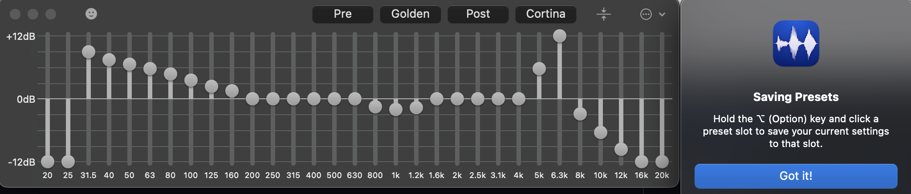
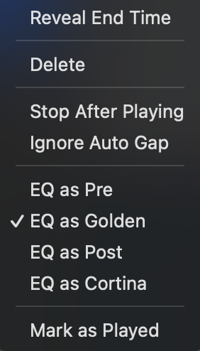

# Embrace (Personal Fork)

[Embrace](https://www.ricciadams.com/projects/embrace) is a music player originally designed by Ricci Adams for the unique challenges of DJing social dance events. It focuses on playing back a single set list without audio glitches or accidental interruptions.

> [!CAUTION]
> **DISCLAIMER:** This version of Embrace is a personal fork used for private experimentation.
> It is **not stable**, has not been vetted for production use, and **is prone to crashing**.
> Use at your own risk.

---

# Changes

## New Feature: Per-Track Equalizer Presets

This fork introduces enhanced equalizer capabilities designed for live performance workflows. You can now define four distinct EQ presets and assign them to specific tracks in your setlist. Embrace will automatically seamlessly switch to the assigned EQ curve when that track begins playing.

### 1. Managing EQ Presets

The Equalizer window now features four quick-access preset slots located above the frequency sliders: **Pre**, **Golden**, **Post**, and **Cortina**.

* **Loading a Preset:** Simply click one of the four buttons to instantly apply those curve settings.
* **Saving a Preset:** Adjust the sliders to your liking. Then, hold the `Option (⌥)` key on your keyboard and click one of the preset buttons to save current state to that slot.

### 2. Assigning Presets to Tracks

Once you have defined your sound profiles, you can assign them to individual songs in your playlist to ensure they always play back with the correct tonality.

1.  Right-click (or Control-click) on any track in your main list.
2.  In the context menu, you will see new options corresponding to your EQ slots (e.g., "EQ as Golden").
3.  Select the desired preset. A checkmark will appear next to the active assignment for that track.

When this track plays, the Equalizer will automatically switch to the selected preset.

## Philosophy

Audio programming is hard. macOS audio programming is harder (usually due to sparse documentation). The original repository was made publicly-viewable in the hopes that its source code could help others.

Embrace is feature-complete and closed to outside contributions. **Please do not submit pull requests to the upstream repository.**

If you are struggling with an audio or DSP concept, you can contact the original creator via his [contact form](https://www.ricciadams.com).

## License

I only care about proper attribution in source code. While attribution in binary form is welcomed, it is not necessary.

Hence, unless otherwise noted, all files in this project are licensed under both the [MIT License](https://github.com/iccir/Embrace/blob/main/LICENSE) OR the [1-clause BSD License](https://opensource.org/license/bsd-1-clause). You may choose either license.

`SPDX-License-Identifier: MIT OR BSD-1-Clause`
